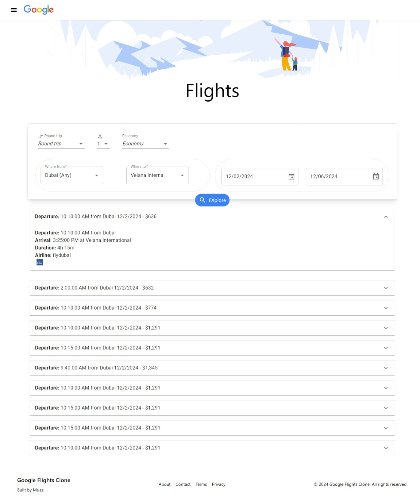

# Google Flights Clone ✈️

Welcome!! Here is a fully responsive clone of Google Flights, built using React, TypeScript, Vite, and Material UI, with live flight data fetched from the Sky Scrapper API via RapidAPI.



## Features

- **Flight Search**: Search for flights between two locations with options for round-trip or one-way.
- **Dynamic Filters**: Choose travel class, number of passengers, and travel dates.
- **Responsive Design**: Fully optimized for all screen sizes.
- **Real-Time Data**: Fetches live flight information using the Sky Scrapper API.
- **Modern UI**: Built with Material UI for an elegant and user-friendly interface.

## Tech Stack

- **Frontend Framework**: React + TypeScript.
- **Vite**: Lightning-fast bundling and development.
- **UI Library**: Material UI
- **API**: [Sky Scrapper API](https://rapidapi.com/apiheya/api/sky-scrapper)
- **Styling**: Material UI and custom CSS
- **Hosting**: Netlify

## Installation

1. **Clone the Repository**:
   ```bash
   git clone https://github.com/Waqas-Baloch99/Google_flight.git
   cd Google_flight
